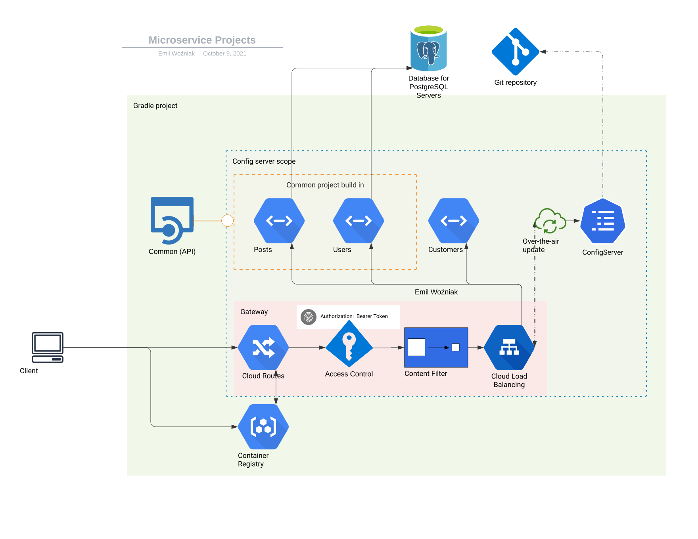

# Getting Started
[TOC]
## Requirement

- **Gradle**
- **Kotlin**
- **common project** in local .m2 repository 
- **config server project**
  - Environment variables
    * URI = web or local store of project properties
    * USER = store username credential
    * PASS = store password credential
- **Postgres**
  - database: *microservice*
  
### Project *common*

Go to [common](./common) project and execute publish to local repository

```bash
gradle publishToMavenLocal
```
or type `ctrl + ctrl`  and then `gradle addCommon`, it also works in other projects.

This will install **common** project to your local m2 repository.

### Database

- Postgresql
    - username: `ifzz`
    - password: `ifzz`
    - database: `microservice`
    - port:     `localhost:5432`

**IMPORTANT**
Execute [schema.sql](src/main/resources/schema.sql) file

You can use also [Docker](./docker/psql/docker-compose.yml) image, with few configurations
this will help you speed up start applications.

All projects can replace use custom database **username**, **password** and **port** by providing
environment variables **DB_PORT**, **DB_USER** and / or **DB_PASS**. I provided those to help
avoid conflicts on the ports.

## Project structure



## Endpoints

- **Eureka server**:  http://localhost:8010
- **Spring Gateway**: http://localhost:8180
- **Posts endpoint**: http://localhost:8020
- **Users endpoint**: http://localhost:8040
- **Customers endpoint**: http://localhost:8060

### Request samples
You can find sample bash - curl or httpie - request 
[Request instruction](assets/request.md)
or
[IntelliJ Ultimate Http Client](http)

### User Security

The definition below solved the `PasswordEncoder` problem. See
[Handler.kt#L19-22](https://github.com/kensiprell/kotlin-spring-security/blob/master/src/main/kotlin/com/siprell/kotlinspringsecurity/SecurityConfiguration.kt#L19-22).

```kotlin
@Bean
fun passwordEncoder(): PasswordEncoder {
    return PasswordEncoderFactories.createDelegatingPasswordEncoder()
}
```

## Used technologies
- Spring Boot 
- Spring Discovery server
- Spring Config Server
- Spring Gateway
- Spring Contract Verifier 
- [RouterFunctionDsl](http://doc.lisonghong.com/docs/kdoc-api/spring-framework/org.springframework.web.reactive.function.server/-router-function-dsl/index.html)
- [R2DBC](https://r2dbc.io/)
- [Spring Cloud Contract](https://spring.io/projects/spring-cloud-contract)

## Properties Store

In my store I use pattern:
<pre>
📦 Project dir
┣ 📜 application.yml
┣ 📂 posts
┃ ┗ 📜 application.yml
┣ 📂 users
┃ ┗ 📜 application.yml
</pre>


## Folders description

Notice that Projects are not Modules

- **common**:
  - *PROJECT*
  - provides common classes for others projects
- **configserver**:
  - *PROJECT*
  - projects properties configuration project
- **contract**
  - *PROJECT*
  - OpenApi models and endpoints 
- **customers**
  - *PROJECT*
  - 
- **docker**:
  - *DIR*
  - docker images
- **gateway**:
  - *PROJECT*
  - projects gateway
- **gradle-addons**:
  - *DIR*
  - gradle common configurations
- **http**:
  - *DIR*
  - sample http requests
- **posts**:
  - *PROJECT*
  - sample api for users
- **src**:
  - *PROJECT*
  - main module and discovery server
- **users**:
  - *PROJECT*
  - user authentication and profile module

## OpenAPI 
I configure OpenAPi kotlin models and webflux endpoints **contract** project

To generate them use `gradle openApiGenerate`
